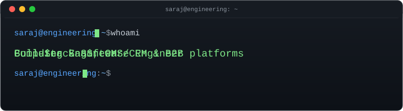

  

  <a href="https://github.com/sarajdhakal">GitHub</a> ·
  <a href="https://linkedin.com/in/saraj-dhakal-592658253">LinkedIn</a> ·
  <a href="https://sarajdhakal.com.np">Portfolio</a> ·
  <a href="mailto:dhakalsaraj@gmail.com">Email</a>

---

Based in Nepal, working across full-stack product development — from database and API design to frontend architecture — with a focus on multi-tenant SaaS, CMS/CRM platforms, and B2B business applications.

### Tech Stack

| Layer | Tools |
|---|---|
| Frontend | React · Next.js · JavaScript · Tailwind CSS · Bootstrap |
| Backend | Node.js · Express · Python · Django · Django REST Framework · PHP |
| Database | PostgreSQL · MySQL · SQLite · Prisma |
| Tooling | Git · GitHub · REST APIs |

### What I Build

- SaaS and multi-tenant platforms
- CMS / CRM systems
- B2B e-commerce and business applications
- REST APIs and backend services
- Database-driven systems with a focus on maintainable architecture

### Live Activity
<!-- Auto-refreshed every 6 hours by .github/workflows/update-readme.yml — see that file for how -->
<!--START_SECTION:activity-->
- Updated a PR in `sarajdhakal/sarajdhakal` — 2026-08-13
- Pushed to `sarajdhakal/sarajdhakal` — 2026-08-13
- Pushed to `sarajdhakal/sarajdhakal` — 2026-08-13
- Pushed to `sarajdhakal/sarajdhakal` — 2026-08-13
- Pushed to `sarajdhakal/sarajdhakal` — 2026-08-13
<!--END_SECTION:activity-->

### GitHub Stats

  
  

Most of what I work on lives in my repositories — feel free to look around.
